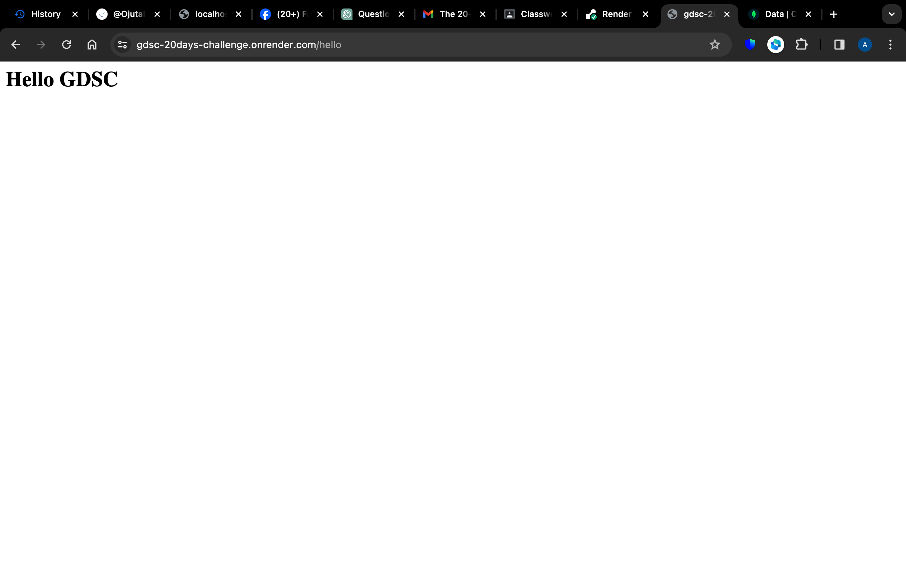
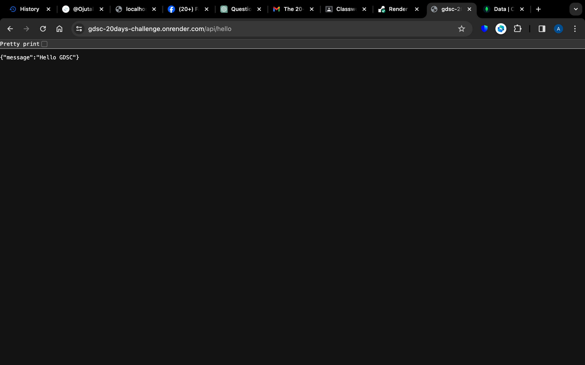
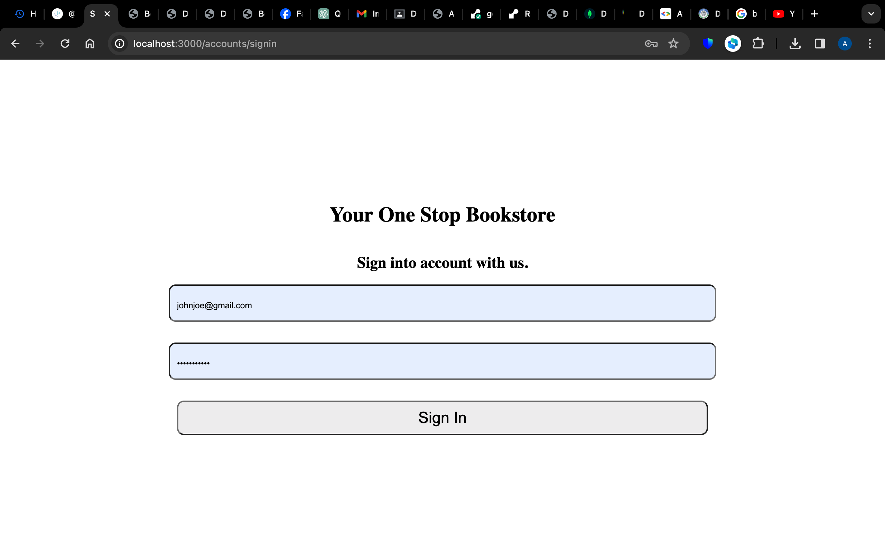
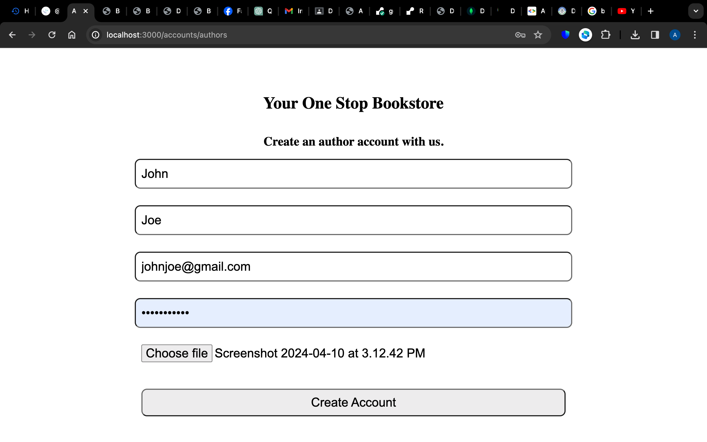
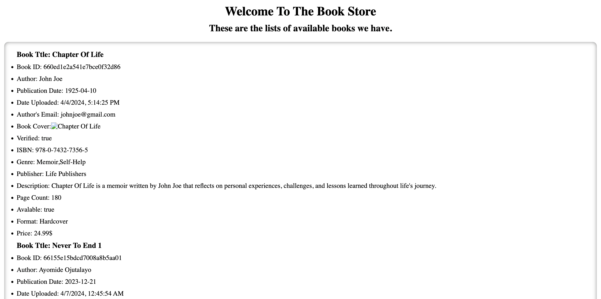
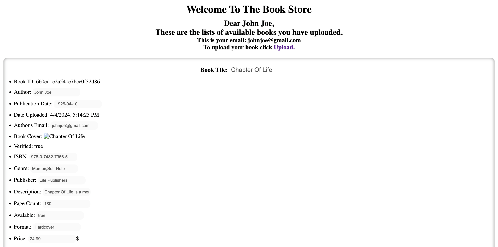
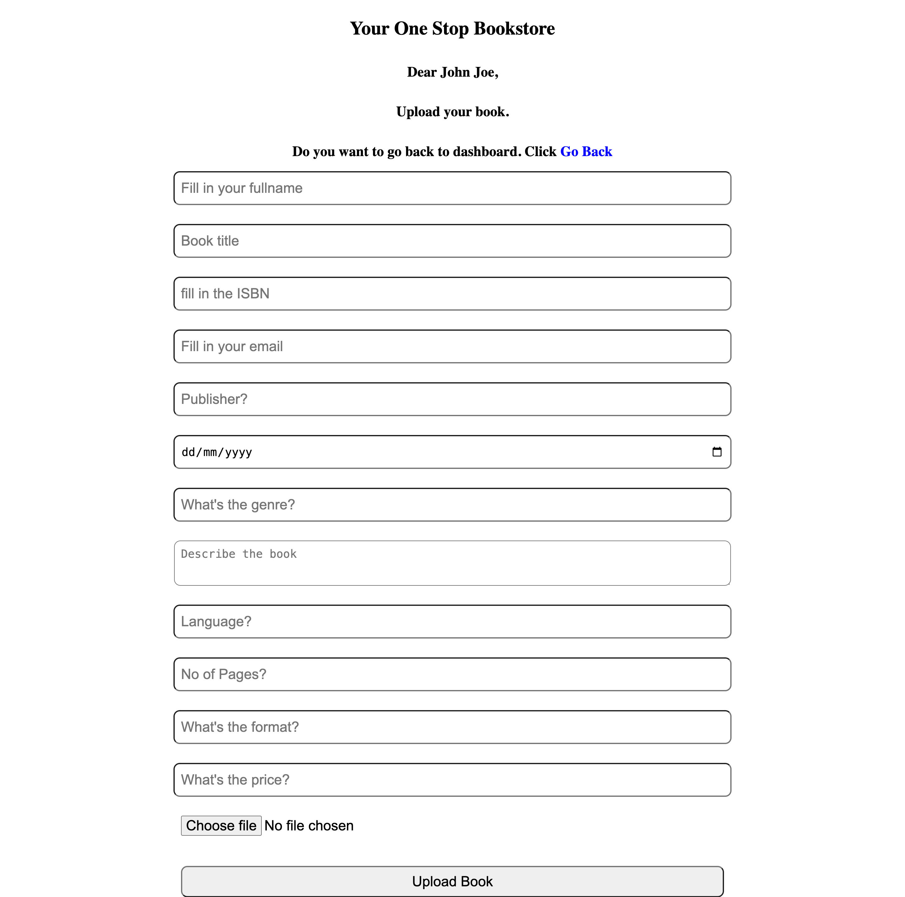

# GDSC - 20 days Backend Development Challenge

This is a solution to the [20 days Backend Development challenge on GDSC](https://dscunilag.dev/challenges).

## Table of contents

- [Overview](#overview)
  - [The challenge](#the-challenge)
  - [Screenshot](#screenshot)
  - [Links](#links)
- [My process](#my-process)
  - [Built with](#built-with)
  - [What I learned](#what-i-learned)
  - [Continued development](#continued-development)
  - [Useful resources](#useful-resources)
- [Author](#author)
- [Acknowledgments](#acknowledgments)

## Overview

### The challenge

THings to be done during this challenge

- Day 1
  - Create a server. 
- Day 2
  - Create two end endpoints, /hello (this endpoint should return the Hello GDSC in bold) and /api/hello (should return the same thing but this time in JSON form with the message property set to “Hello GDSC”).
- Day 3:
  - Connect to a database
- Day 4:
  - Create an API for a bookstore.
- Day 5-6:
  - Create API endpoints that performs CRUD operations
- Day 7-8:
  - Set up custom user authentication. Where a user in the bookstore, enters his name and password before he can get access to any book.
- Day 9-10
  - Using a library, create support for authentication using Bearer tokens  

### Screenshot

### Links

- Solution URL: [Solution URL here](https://github.com/ojutalayomi/gdsc-20days-challenge)
- Live Site URL(/hello): [Live site URL here](https://gdsc-20days-challenge.onrender.com/hello)
- Live Site URL(/api/hello): [Live site URL here](https://gdsc-20days-challenge.onrender.com/api/hello)
- Live Site URL(/signup): [Live site URL here](https://gdsc-20days-challenge.onrender.com/accounts/authors)
- Live Site URL(/signin): [Live site URL here](https://gdsc-20days-challenge.onrender.com/accounts/signin)
- Live Site URL(/bookstore): [Live site URL here](https://gdsc-20days-challenge.onrender.com/bookstore)

## My process

- Day 1:
  - I created an express server with node js.
- Day 2:
  - I created the /hello and /api/hello endpoints. They both returned the expected response.
- Day 3:
  - I connected to a NoSQL database which is MongoDB  
- Day 4:
  - The bookstore api was created
- Day 5-6:
  - Only registered users can now create books, view available books, update books and delete any of their books.
- Day 7-8:  
  - Users can on perform CRUD operations when signed in.
- Day 9-10:  
  - I used the JWT library to generate bearer tokens (which I set to expire in an hour, after which the user will be redirected to signin to refresh the token.)   

### Built with

- JavaScript
- Express
- Nodejs

### Continued development

I still plan to complete the challenge

## Author

-Challenge Website - [GDSC-CHALLENGE](https://dscunilag.dev/)
- Website - [Ayomide Ojutalayo](https://ojutalayomi.github.io/i)
- Twitter - [@ojutalayomi](https://www.twitter.com/ojutalayomi)
- Twitter - [@googledevs](https://twitter.com/googledevs)

****

## Acknowledgments

I would like to acknowledge [Google Dev Student Community](https://gdsc.community.dev/university-of-lagos/) for providing the challenge and the opportunity to learn.
